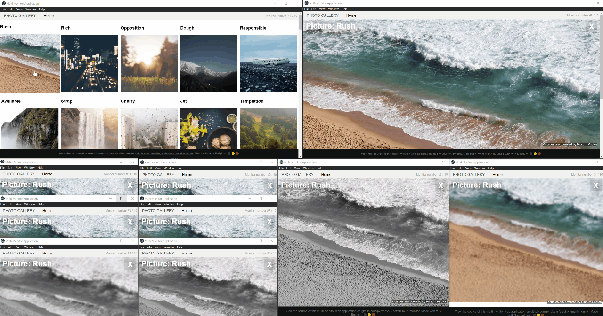

# Electron Multi Monitor


## Introduction
This package provides web developers with the ability to create applications which cover multiple browser windows via [Electron](https://electronjs.org/).
It removes the restriction for web developers to only have a single window to develop their product in.

The library will create linked JavaScript `window` objects for you. Meaning you only need to worry about one window object. No need for special communication between the different windows; just pure JavaScript!

To see the library in action, clone the repository and run the example:

    $ git clone https://github.com/pvrobays/electron-multi-monitor.git
    $ cd electron-multi-monitor
    $ npm i
    $ npm run example

## Demo
### 2-monitor example


### 10-monitor example 🤷‍
Overkill. But possible.



## Getting Started
You can always check out the code from the demo, found in the `example` folder.

### 1. Installation & Import
Easiest way to install it is via [npm](https://www.npmjs.com/get-npm):
```
npm install electron-multi-monitor
```
Next you'll be able to import the MultiMonitor object inside your [Electron](https://electronjs.org/) app:
```
import { MultiMonitor } from "electron-multi-monitor";
```

### 2. Create a MultiMonitor instance
There are 2 ways of creating  MultiMonitor instance:

1. Use the default instance
```
const multiMonitor = MultiMonitor.instance;
```
2. or, Create your own via the MultiMonitorFactory
```
const multiMonitor = new MultiMonitorFactory().create();
```
The `multiMonitor` object can be used to adapt, move, interact with the opened windows within your Main process:
```
interface IMultiMonitor {
    readonly monitors: BrowserWindow[];
    openUrl(url: string, numberOfMonitors: number): Promise<void>;
    destroyAllMonitors(): void;
}
```

### 3. Launch multiple monitors
Now you can open your multi-monitor page via the MultiMonitor instance:
```
multiMonitor.openUrl(url, numberOfWindowsToOpen)
.then(() => {
    console.log("Monitor windows are opened have your URL loaded!");
});
```

This will open your url inside the number of windows you've defined.
Now you'll have the object `window.electronMultiMonitor` available in your render process:

```
interface IElectronMultiMonitor {
    readonly mainWindow: Window;
    readonly otherMonitors: IOtherMonitor[];
    readonly numberOfMonitors: number;
}

interface IOtherMonitor {
    readonly htmlRoot: HTMLElement;
    readonly window: Window;
}
```

It's now your responsibility to render the different UI elements on the different htmlRoots.
If you don't want this responsibility, you can check out [electron-multi-monitor-react](https://github.com/pvrobays/electron-multi-monitor-react) which does all this for you.

## Contribute
Yes please! I'm looking for motivated contributors to help me. If you're interested don't hesitate to contact me.

## Thanks
* [Picsum Photos](https://picsum.photos/) - Hosting the images for the example app